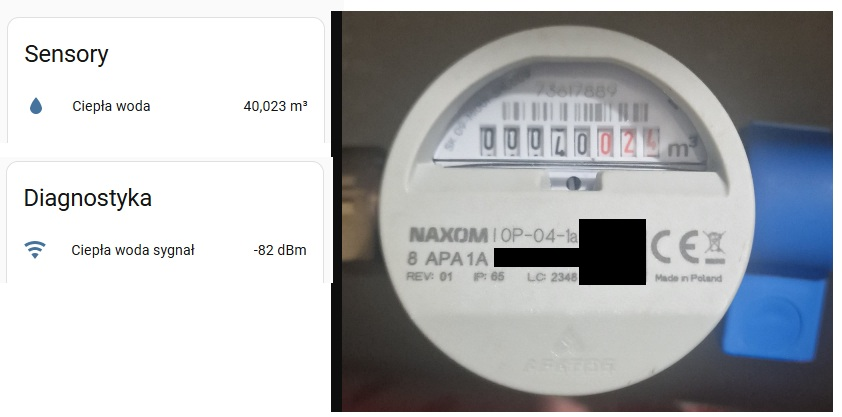

# This is a fork of Szczepan's custom esphome components that supports water metering using the Apator NAXOM: OP-04-1a, OP-04-1b, and OP-04-2.

This has been tested with ESP32 and CC1101.

[Original source](https://github.com/SzczepanLeon/esphome-components/tree/version_4/)


## 1. Usage

Use latest [ESPHome](https://esphome.io/)
with external components and add this to your `.yaml` definition:

```yaml
external_components:
  - source: github://MaciejR89/esphome-components@version_4
```

## 2. Example

```yaml
captive_portal:

time:
  - platform: sntp
    id: time_sntp

external_components:
  - source: github://MaciejR89/esphome-components@version_4
    refresh: 0d
    components: [ wmbus ]


wmbus:
  mosi_pin: GPIO23
  miso_pin: GPIO19
  clk_pin:  GPIO18
  cs_pin:   GPIO15
  gdo0_pin: GPIO4
  gdo2_pin: GPIO27

  led_pin: GPIO2
  led_blink_time: "1s"

  frequency: 868.950
  all_drivers: False
  sync_mode: True
  log_all: True

sensor:
  - platform: wmbus
    meter_id: 0x********
    # ^^ Replace the * with the ID of your water meter
    type: apator_op04
    key: "********************************"
    # ^^ Replace the * with the key assigned to your water meter

    sensors:
      - name: "Ciepła woda sygnał"
        field: "rssi"
        accuracy_decimals: 0
        unit_of_measurement: "dBm"
        device_class: "signal_strength"
        state_class: "measurement"
        entity_category: "diagnostic"

      - name: "Ciepła woda"
        field: "total"
        accuracy_decimals: 3
        unit_of_measurement: "m³"
        device_class: "water"
        state_class: "total_increasing"
        icon: "mdi:water"


  - platform: wmbus
    meter_id: 0x********
    # ^^ Replace the * with the ID of your water meter
    type: apator_op04
    key: "********************************"
    # ^^ Replace the * with the key assigned to your water meter

    sensors:
      - name: "Zimna woda sygnał"
        field: "rssi"
        accuracy_decimals: 0
        unit_of_measurement: "dBm"
        device_class: "signal_strength"
        state_class: "measurement"
        entity_category: "diagnostic"

      - name: "Zimna woda"
        field: "total"
        accuracy_decimals: 3
        unit_of_measurement: "m³"
        device_class: "water"
        state_class: "total_increasing"
        icon: "mdi:water"
```

Then in logs you will have trace with telegram:
```
[12:23:13.376][I][wmbus:100]: apator_op04 [0x********] RSSI: -82dBm T: 71440106010104101A078CC0477A53306085592FDF3018AE4AEFC0C7CE6E8EF21C6984F36E9B5CBB2128B0BC1DD3DE8C9B1779AA4990820972699F461E241ECE89554D3AEAF6A761941EB5042B32BE7333154A5331594FAF3BA294221CFDEA25D9D89B196A161DF8FDCDAE7E321C36BE6089 (114) T1 A
[12:23:13.383][D][meters.cpp:1985]: (meter) created ESPHome apator_op04 10040101 encrypted
[12:23:13.397][D][meters.cpp:909]: (meter) ESPHome(0) apator_op04  handling telegram from 10040101.M=APA.V=1a.T=07
[12:23:13.406][D][Telegram.cpp:563]: (telegram) ELL CI=8c CC=c0 (bidir fast_resp) ACC=47
[12:23:13.414][D][sensor:135]: 'Ciepła woda sygnał': Sending state -82.00000 dBm with 0 decimals of accuracy
[12:23:13.429][D][sensor:135]: 'Ciepła woda': Sending state 40.02300 m³ with 3 decimals of accuracy
```


## 3. Results



## 4. Author & License

 SzczepanLeon, MaciejR89 / GPL, 2026
